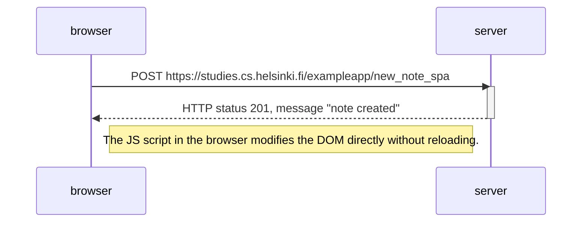

```mermaid
sequenceDiagram
    participant browser
    participant server
    
    browser->>server: POST https://studies.cs.helsinki.fi/exampleapp/new_note_spa
    activate server
    server-->>browser: HTTP status 201, message "note created"
    deactivate server
    Note right of browser: The JS script in the browser modifies the DOM directly without reloading.
```
